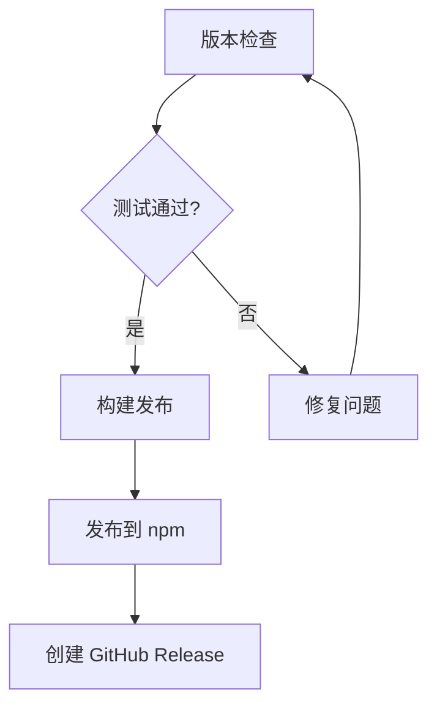

# 32. Skill/技能系统深度对比

> Skill 系统让 AI 编程代理从"通用助手"进化为"领域专家"。从 SKILL.md frontmatter 到 Flow Skill 流程图编排，各工具的实现理念完全不同。

## 总览

| Agent | Skill 格式 | 内置数 | 条件激活 | 工具白名单 | 模型覆盖 | 上下文隔离 | 工作流编排 |
|------|-----------|--------|---------|-----------|---------|-----------|-----------|
| **Claude Code** | SKILL.md（YAML 可选） | **10+** | ✓（paths glob） | **✓** | **✓** | **✓（fork）** | ✗ |
| **Kimi CLI** | SKILL.md + **Flow Skill** | 标准+Flow | ✓（三层发现） | ✗ | ✗ | ✓（子代理） | **✓（Mermaid/D2）** |
| **OpenCode** | SKILL.md（Hook 驱动） | 0+ | ✓（per-agent） | ✗（Hook 控制） | ✗ | ✗ | ✗ |
| **Gemini CLI** | SKILL.md（TS 接口） | — | ✓（activate_skill） | ✗ | ✗ | ✗ | ✗ |
| **Qwen Code** | SKILL.md（**YAML 必须**） | 1+（/review） | ✓（继承） | ✗ | **✓**（[PR#2949](https://github.com/QwenLM/qwen-code/pull/2949) ✓，2026-04-13 合并，同 provider） | ✗ | ✗ |
| **Codex CLI** | SKILL.md（Markdown） | 0 | ✗ | ✗ | ✗ | ✗ | ✗ |
| **Copilot CLI** | `.agent.yaml` | 3 内置 | ✗ | ✓（per-agent） | ✓ | ✗ | ✗ |
| **Goose** | `recipe.yaml` | 0 | ✗ | ✗ | ✗ | ✗ | **✓（YAML 模板）** |
| **Cline** | Markdown Skills + Workflows | 自定义 | ✗ | ✗ | ✗ | ✓（Subagent） | **✓（Workflows）** |
| **Hermes Agent** | SKILL.md + 4 子目录（references/templates/scripts/assets） | — | ✗ | ✗ | ✗ | **✓（后台 review）** | **✓（自主 create + patch 自修补）** |

> **Hermes Agent 的独特卖点**：**Agent 自主创建 + 自主修补 skill**。源码 `agent/prompt_builder.py:164-171` 明确指示代理"发现 skill 过时立即 patch，不等用户"。双计数器 Nudge（10 轮用户回合 / 10 次工具调用）触发后台 review 子代理，决定是否沉淀新 skill。详见 [闭环学习系统深度对比](./closed-learning-loop-deep-dive.md)。

---

## 一、Claude Code：SKILL.md + Frontmatter（最完整）

> 来源：05-skills.md、二进制反编译 v2.1.81

### SKILL.md Frontmatter 字段

```yaml
---
name: deploy-check            # 显示名称
description: 检查部署前的清单   # LLM 判断何时调用
user-invocable: true          # 是否在 / 菜单显示
disable-model-invocation: false  # 禁止 LLM 主动调用
allowed-tools:                # 工具白名单
  - Read
  - Bash(npm run *)
  - Glob
argument-hint: "<环境名>"      # 参数提示
when_to_use: "用户要求部署检查时"  # 触发条件
model: sonnet                 # 模型覆盖（sonnet/opus/haiku）
effort: high                  # 推理努力（low/medium/high/max）
context: fork                 # 独立上下文（不污染主对话）
paths:                        # 条件激活 glob 模式
  - "*.py"
  - "src/**"
---

检查以下部署清单项目...
（Skill 正文作为 prompt）
```

### 10+ 内置 Skill

| Skill | 类型 | 功能 |
|-------|------|------|
| `/commit` | prompt | 分析 git diff，生成提交消息 |
| `/review` | prompt | 获取 diff/PR，多代理代码审查 |
| `/commit-push-pr` | prompt | 一键 commit+push+PR |
| `/init` | prompt | 分析项目，生成 CLAUDE.md |
| `/init-verifiers` | prompt | 创建验证器 Skill |
| `/loop` | skill | 按间隔循环执行命令 |
| `/schedule` | skill | 管理 cron 定时任务（CCR 云端） |
| `/simplify` | skill | 审查代码复用性和质量 |
| `/update-config` | skill | 对话式修改 settings.json |
| `/claude-api` | skill | Claude API 开发辅助 |

### Skill 加载流程

```
pdA() 扫描所有目录
  → hw() 解析 YAML frontmatter
  → 内容哈希去重（crypto SHA）
  → 条件 Skill → TTH Map（paths 匹配时激活）
  → 无条件 Skill → Vn Map（始终可用）
```

### Frontmatter 加载策略差异（二进制验证）

这是一个重要的设计哲学差异——**Claude Code 是唯一允许无 frontmatter 的 Agent**，所有其他 Agent 都要求严格校验：

| Agent | frontmatter | name 必须 | description 必须 | 无 frontmatter 行为 |
|-------|------------|----------|-----------------|-------------------|
| **Claude Code** | **可选** | ✗ | ✗ | 空元数据 + 全文作为 prompt |
| **Qwen Code** | 必须 | **✓** | **✓** | 抛异常，不加载 |
| **Gemini CLI** | 必须 | **✓** | **✓** | `'No YAML frontmatter found'` → 无效 |
| **Codex CLI** | 必须 | — | — | `invalid SKILL.md files` 警告 |
| **OpenCode** | 必须 | — | — | `FrontmatterError` 异常 |

以下是 Claude Code 和 Qwen Code 的源码级对比：

**Claude Code（宽松：YAML 可选）**

```javascript
// 从 v2.1.84 二进制提取（函数 vw）
function vw(H, $) {
  let q = H.match(YV8);       // 尝试匹配 YAML frontmatter
  if (!q) return {
    frontmatter: {},           // 无 frontmatter → 空对象
    content: H                 // 全文内容作为 prompt
  };
  // 有 frontmatter → 正常解析
}
```

- 没有 YAML frontmatter 的 SKILL.md **照常加载**
- 整个文件内容作为 Skill prompt
- `name` / `description` 缺失时，模型自行推断用途
- 设计理念：**信任模型理解能力**，不强制元数据

**Qwen Code（严格：YAML 必须 + name + description 必须）**

```javascript
// 从 v0.16.0 packages/core/src/skills/skill-load.ts 提取
const match = normalizedContent.match(frontmatterRegex);
if (!match) {
  throw new Error("Invalid format: missing YAML frontmatter");  // ← 直接报错！
}
const frontmatter = parse(frontmatterYaml);
if (!frontmatter.name) {
  throw new Error('Missing "name" in frontmatter');              // ← name 必须
}
if (!frontmatter.description) {
  throw new Error('Missing "description" in frontmatter');       // ← description 必须
}
```

- 没有 YAML frontmatter → **抛出异常，Skill 不加载**
- 有 frontmatter 但缺 `name` → 异常
- 有 frontmatter 但缺 `description` → 异常
- 设计理念：**严格校验**，确保 harness 层面的元数据完整性

**对比总结**：

| 维度 | Claude Code | Qwen Code |
|------|------------|-----------|
| YAML frontmatter | **可选** | **必须** |
| `name` 字段 | 可选 | **必须** |
| `description` 字段 | 可选 | **必须** |
| 无 frontmatter 行为 | 空元数据 + 全文作为 prompt | **抛出异常，不加载** |
| 设计理念 | 信任模型推断能力 | 依赖 harness 结构化校验 |

> **实际影响**：将 Claude Code 的 Skill 文件直接复制到 Qwen Code 的 `.qwen/skills/` 目录时，如果该 Skill 没有 YAML frontmatter，Claude Code 能正常加载但 Qwen Code 会**抛出异常，Skill 不加载**。迁移时需要补充 frontmatter。

### 条件激活（Conditional Skills）

```yaml
paths:
  - "*.py"          # 编辑 Python 文件时激活
  - "src/auth/**"   # 编辑认证模块时激活
```

使用 `ignore` 库匹配（类似 .gitignore 规则）。激活时发射 `tengu_dynamic_skills_changed` 事件。

### 独有特性

- **context: fork** — Skill 在独立上下文执行，不污染主对话
- **allowed-tools** — 限制 Skill 可用的工具（安全沙箱）
- **model** — 为特定 Skill 指定不同模型（如用 Haiku 做轻量任务）
- **Prompt Hook** — Hook 可以拦截 Skill 执行决策

---

## 二、Kimi CLI：标准 Skill + Flow Skill（最独特）

> 源码：`soul/slash.py`、skills 目录

### 标准 Skill

```bash
/skill:deploy-check    # 调用标准 Skill
```

SKILL.md 文件定义指令文本，三层发现优先级：
1. `builtin`（内置）
2. `~/.kimi/skills/`（用户级）
3. `.kimi/skills/`（项目级）

### Flow Skill（独有：Mermaid/D2 流程图编排）

```bash
/flow:release          # 调用 Flow Skill
```

SKILL.md 中嵌入 Mermaid 或 D2 流程图：

````markdown
---
name: release-flow
---


````

**执行原理**：Kimi CLI 解析流程图，按图中定义的步骤顺序执行，支持分支和迭代。这是**唯一将可视化工作流定义与 AI 执行结合**的实现。

---

## 三、Copilot CLI：YAML Agent 定义

> 来源：03-architecture.md、EVIDENCE.md

Copilot CLI 不使用 SKILL.md，而是 `.agent.yaml` 定义专用代理：

```yaml
# definitions/code-review.agent.yaml
name: code-review
model: claude-sonnet-4.5
tools: ["*"]
promptParts:
  instructions: |
    You are an expert code reviewer.
    Finding feedback should feel like finding
    a $20 bill in jeans before the wash.

    Review dimensions:
    - bugs, security, race conditions
    - memory leaks, error handling
    - breaking changes, performance

    DO NOT report: style, formatting, suggestions
```

### 三个内置代理

| 代理 | 模型 | 工具权限 | 输出限制 |
|------|------|---------|---------|
| code-review | Sonnet 4.5 | `["*"]` | 详细审查报告 |
| explore | Haiku 4.5 | grep/glob/view/lsp | 300 字符 |
| task | Haiku 4.5 | `["*"]` | 最小输出 |

---

## 四、Goose：Recipe 系统（YAML 任务模板）

> 来源：goose.md

```yaml
# recipes/daily-report.yaml
task: "生成每日代码变更报告"
description: "扫描最近 24 小时的 Git 提交并生成摘要"
parameters:
  type: object
  properties:
    repo_path:
      type: string
      description: "仓库路径"
  required: ["repo_path"]
```

```bash
goose run recipes/daily-report.yaml              # 执行
goose schedule add --recipe daily-report.yaml \
  --cron "0 0 9 * * *"                           # 定时调度
```

Recipe = 可参数化 + 可调度的 Skill 等价物。

---

## 五、OpenCode：Hook 驱动的 Skill 系统

> 来源：03-architecture.md

- SKILL.md 文件支持（兼容 .claude/skills/ 和 .gemini/skills/ 路径）
- 通过 `tool.definition` Hook 动态修改 Skill 描述/参数
- 通过 `permission.ask` Hook 控制 Skill 权限
- **per-agent 过滤**：不同代理可见不同 Skill

---

## 六、Codex CLI：SKILL.md + MCP 依赖声明

> 来源：02-commands.md

```markdown
# 部署检查

## 指令
检查生产环境部署前的清单...

## MCP 依赖
- github-server: GitHub MCP 服务器
```

指令文件优先级：`~/.codex/instructions.md` < `CODEX.md` / `AGENTS.md` < `SKILL.md`

---

## Skill vs 相关概念辨析

| 概念 | 定义 | 代表工具 |
|------|------|---------|
| **Skill** | 用户定义的可复用指令包（SKILL.md） | Claude Code、Gemini CLI、Kimi CLI |
| **Plugin** | 包含 skills/hooks/agents/mcp.json 的完整包 | Claude Code（13 官方插件） |
| **Extension** | 类似 Plugin 的扩展 | Gemini CLI、Qwen Code |
| **Recipe** | 参数化 YAML 任务模板 + Cron 调度 | Goose |
| **Workflow** | 完整工作流编排 | Cline |
| **Flow Skill** | Mermaid/D2 流程图驱动的 Skill | Kimi CLI |
| **Agent YAML** | 专用代理定义（非用户 Skill） | Copilot CLI |

---

## 跨 Agent Skill 兼容性

```
Claude Code 插件               Qwen Code / Gemini CLI
.claude-plugin/                .qwen/skills/ 或 .gemini/skills/
  plugin.json         →       （元数据合并到 SKILL.md frontmatter）
  commands/            →       SKILL.md 文件
  skills/              →       SKILL.md 文件
  hooks/               →       settings.json hooks 配置
```

> **注意**：转换不是 100% 等价——Claude Code 的 `context: fork`、`allowed-tools`、`model` 覆盖在 Gemini/Qwen 中无直接对应。

---

## 渐进式披露与上下文工程（来源：[Anthropic Engineering Blog](https://www.anthropic.com/engineering/effective-context-engineering-for-ai-agents)，2025-09-29）

Anthropic 在上下文工程实践中发现：**Skill 文档的加载不应一次性灌入全部内容**，而应采用渐进式披露（Progressive Disclosure）——Agent 通过探索逐步发现相关上下文，每次交互产生的上下文为后续决策提供信息。

> "Letting agents navigate and retrieve data autonomously also enables progressive disclosure—in other words, allows agents to incrementally discover relevant context through exploration."

### 三层上下文策略

| 层 | 名称 | 加载时机 | 对应实现机制 |
|---|------|---------|-------------|
| 1 | **预加载上下文** | 会话启动时 | AGENTS.md/CLAUDE.md 注入系统提示 |
| 2 | **即时检索** | 运行时按需 | Skill 通过 `glob`/`grep` 动态发现文件 |
| 3 | **持久化外部记忆** | 跨会话持久 | `NOTES.md`、auto-memory、progress 文件 |

> "Claude Code is an agent that employs this hybrid model: CLAUDE.md files are naively dropped into context up front, while primitives like glob and grep allow it to navigate its environment and retrieve files just-in-time."

### 对 Skill 设计的启示

| 原则 | 说明 | 反面案例 |
|------|------|---------|
| **最小高信号 token 集** | Skill 正文只包含当前任务最相关的指令 | 将完整 API 文档塞入 SKILL.md |
| **简洁明确的描述** | `description` 字段用简单语言写清用途 | 模糊描述导致模型选错 Skill |
| **典型示例优于穷举** | 用 2-3 个代表性示例替代所有边界情况 | 列出 20 种输入格式的 Skill |

> "Good context engineering means finding the smallest possible set of high-signal tokens that maximize the likelihood of some desired outcome."

### 各 Agent 的渐进式披露实现

| Agent | 预加载 | 即时检索 | 外部记忆 |
|------|--------|---------|---------|
| **Claude Code** | CLAUDE.md（无条件） | Agent 工具动态发现 + 条件 Skill（`paths` glob 按需激活） | auto-memory 4 类型 |
| **Gemini CLI** | GEMINI.md + activate_skill | codebase_investigator 只读探索 | memory_manager → GEMINI.md |
| **Qwen Code** | AGENTS.md + 继承 Skill | 继承 codebase_investigator 类似机制（glob/grep/read） | save_memory 工具 |
| **Kimi CLI** | 三层 Skill 发现 | Agent 工具委托 | ✗ |
| **Copilot CLI** | `.agent.yaml` 注入 | explore 代理（只读） | ✗ |

> **实践建议**：设计 Skill 时，将**元数据层**（frontmatter）、**核心指令**（正文前半段）、**补充文件**（通过工具按需读取）分开。不要把所有信息都塞进 SKILL.md 正文——让 Agent 在执行过程中按需发现。

### Agent Skills 的三层渐进式加载（来源：[Anthropic Engineering Blog](https://www.anthropic.com/engineering/equipping-agents-for-the-real-world-with-agent-skills)，2025-10-16）

Anthropic 将 Skill 比作"一本组织良好的手册——从目录开始，到具体章节，再到详细附录"：

| 层 | 名称 | 加载条件 | 示例 |
|---|------|---------|------|
| 1 | **元数据层** | 始终加载到系统提示 | SKILL.md 的 YAML frontmatter（name + description） |
| 2 | **内容层** | Skill 变得相关时加载 | SKILL.md 正文（完整指令） |
| 3 | **引用层** | Agent 按需访问 | 捆绑的脚本、配置模板、示例文件 |

> "Because agents have filesystem and code execution tools, the amount of context that can be bundled into a skill is effectively unbounded."

这意味着 Skill 的上下文容量**不受 SKILL.md 文件大小限制**——复杂的领域知识可以放在引用文件中，Agent 在执行过程中按需读取。

---

## 证据来源

| Agent | 来源 | 获取方式 |
|------|------|---------|
| Claude Code | 05-skills.md（271 行）+ 二进制分析 | 反编译 + 文档 |
| Kimi CLI | 03-architecture.md + EVIDENCE.md | 开源 |
| Copilot CLI | 03-architecture.md + EVIDENCE.md | SEA 反编译 |
| Goose | goose.md | 开源 |
| OpenCode | 03-architecture.md | 开源 |
| Codex CLI | 02-commands.md | 二进制 + 官方文档 |
| Gemini CLI | 02-commands.md | 开源 |
| Cline | cline.md | 开源 |
